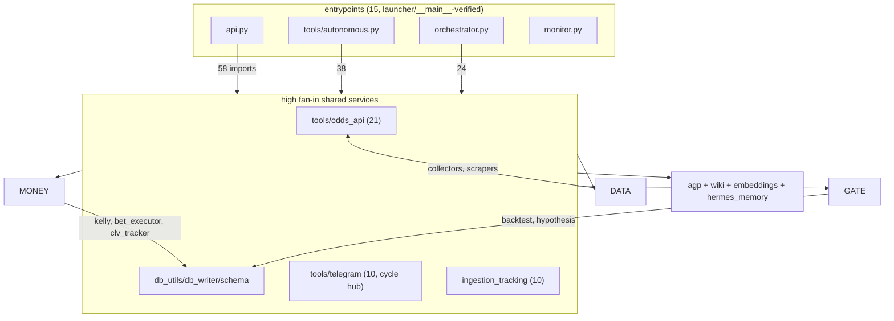

# ARCHITECTURE_MAP — Wave 1 Cartography

**Branch:** `cartography/architecture-map` (off `audit/2026-08-roadmap` @ `fdf4d1d`)
**Date:** 2026-08-22 · **Scope:** `tools/`, `agp/`, root `*.py` (143 modules), cross-referenced against `tests/` (93 files), `scripts/`, and launchers.
**Method:** static AST analysis (import resolution incl. function-level imports, reference counting over names/attributes/strings/`__all__`), vulture 2.16 @ min-confidence 60, and a **real coverage run** (`pytest --cov`, 1,006 passed / 12 failed / 8 skipped, 2 files uncollectable in this env).

Evidence discipline per AUDIT_MANDATE §1: every claim below is tagged **VERIFIED** (measured against this tree) or **INFERRED** (reasoned). Analysis scripts live in `/tmp/opencode/callisto/` (throwaway, not committed); all numbers regenerate from this tree.

---

## 1. Import graph — VERIFIED

143 nodes, 324 internal import edges — of which only **153 are import-time (module-level)**. **Zero import-time cycles.** All 27 cycles in the full graph are created by *function-level (deferred) imports* — a deliberate-looking pattern that avoids import deadlocks but hides coupling.

### 1.1 God-modules (fan-in = how many modules import it; fan-out = internal imports it makes)

| rank | highest fan-in | in | | highest fan-out | out |
|---|---|---|---|---|---|
| 1 | `tools.odds_api` | 21 | | `api` | 58 |
| 2 | `tools.math_utils` | 14 | | `tools.autonomous` | 38 |
| 3 | `tools.db_utils` | 13 | | `orchestrator` | 24 |
| 4 | `tools.db_writer` | 12 | | `tools.line_monitor` | 22 |
| 5 | `tools.telegram` | 10 | | `tools.backtest` | 12 |
| 6 | `tools` (pkg init) | 10 | | `tools.edge_scanner` | 10 |
| 7 | `tools.ingestion_tracking` | 10 | | `tools.hypothesis` | 10 |
| 8 | `tools.embeddings` | 7 | | `tools.self_repair` | 10 |
| 9 | `inference` | 7 | | `tools.bet_executor` | 8 |
| 10 | `tools.book_keys` | 7 | | `tools.clv_tracker` | 8 |

**Reading:** `api` (fan-out 58) and `tools.autonomous` (38) import half the system — they are the hubs. `tools.odds_api` (fan-in 21) is the shared odds vocabulary. `tools.telegram` is fan-in 10 **and** participates in 18 of 27 cycles: every subsystem imports the notifier and the notifier reaches back — the notification layer has become a de-facto service locator.

### 1.2 Cycles — VERIFIED (all lazy)

- Import-time cycles: **0**.
- All-scope cycles: 27. **25 of 27 route through the `api` ↔ `tools.telegram` pair** (telegram is imported lazily inside functions across api/autonomous/event_bus/line_monitor/order_*/bet_executor/clv_tracker/data_collector/self_repair/health).
- The 3 hub-free mutual imports: `tools.order_manager ↔ tools.order_reconciler`, `tools.backtest ↔ tools.schema`, `tools.hypothesis ↔ tools.hypothesis_generator`.

**Finding (INFERRED):** the lazy-import web around `telegram` is the single largest structural debt. It makes "who actually depends on the notifier" unmeasurable by import-time analysis and means any refactor of `telegram.py` (fan-in 10, fan-out to api) has hidden blast radius.

### 1.3 Orphans (fan-in = 0, not an entrypoint, no test/script consumer) — VERIFIED

12 real orphans after excluding `tools.migrations.*` (001–012 are discovered and `importlib.import_module`-loaded by `tools/migrations/runner.py` — **not dead**, convention-loaded):

| orphan | what it is | note |
|---|---|---|
| `tools.ml_backtest` | ML signal trading sim | 0% line coverage; no test, no script, no launcher |
| `tools.news_loop` | background news coroutines | 0% coverage; superseded? (news_ingestion has its own loop) — INFERRED retire candidate |
| `wal_fix` | 9-line one-off WAL patch | one-off, attic candidate |
| `analysis` | root analysis script | debug artifact |
| `callisto_query`, `callisto_query2`, `query_bt`, `query_hyps`, `query_hyps_debug`, `query_pipeline`, `run_query`, `check_nba_events` | root one-off debug scripts | 8 files, ~580 lines of session debris |

**Caveat (VERIFIED limitation):** `tools/self_repair.py:233,470` calls `__import__(mod_path)` with config-driven paths, so a static pass cannot prove *anything* unreachable against a hostile config. The orphan table holds for the shipped configuration.

### 1.4 Shape (mermaid, tier-level; full graph regenerable from scripts)

### 1.5 Entrypoints (15) — VERIFIED via `__main__` blocks or shell launchers

`api`, `monitor`, `upstream_review` (root); `tools.autonomous`, `tools.callisto_mcp_server`, `tools.local_cc_bridge`, `tools.tci_scraper` (`__main__`); `tools.claude_code`, `tools.embeddings`, `tools.health`, `tools.line_monitor`, `tools.odds_api`, `tools.searxng`, `tools.environment`, `tools` (matched in `scripts/` shells / docker-compose / bridge scripts — stem-match evidence, medium confidence for the last four).

---

## 2. Dead code — VERIFIED (method + full lists)

Two independent passes, then reconciled:

1. **vulture 2.16, min-confidence 60** over `tools/ agp/ *.py`: **439 findings** (202 unused functions, 143 unused variables, 41 unused attributes, 29 unused methods, 22 unused imports, 1 class, 1 property).
2. **AST reference pass** over 2,096 non-test function/method defs, counting every `Name`, `Attribute`, import alias, string literal (≥3 chars, catches `getattr`/dict-dispatch), and `__all__` export across the whole repo (tests and scripts included as reference sources).

AST pass reconciliation — confidence labels:

| category | count | confidence | meaning |
|---|---|---|---|
| **DEAD** — zero references anywhere in repo | **64** | high | no name/attr/string/import alias mentions at all |
| dead-excluded (dynamic risk) | 100 | excluded | decorated (route/fixture/handler) or inherited-class method or in `__all__` |
| **TEST-ONLY** — referenced only from `tests/` | 11 | high | production code never calls them |
| **OWN-TEST-ONLY** — referenced only by the test file named after their own module | 8 | high | "kept alive only by its own test" |
| module-internal-only | ~950 | n/a | private helpers used within their own file — alive, not listed |
| live | 904 | n/a | referenced from ≥1 production file |

**Method caveats (falsifiers in §6):** docstrings and string literals are treated as references (over-inclusive by design); comments are not parsed and do not keep code alive; decorated functions are never claimed dead because FastAPI/pytest/click discover them by decoration; `self_repair`'s config-driven `__import__` can resurrect any module at runtime. "Imported but never called" is reported separately — the AST pass counts import aliases as references (conservative), so such functions appear live here even if no call site exists.

### 2.1 The 64 high-confidence dead functions (VERIFIED zero references)

Grouped by subsystem — **money-path items bolded** (they are Tier-0 adjacent and dead):

**Execution / orders / money**
- `tools/bet_executor.py:219` `BetExecutor.get_daily_stakes` — a stake-limit query nobody calls
- `tools/order_reconciler.py:164` `_american_payout`
- `tools/order_manager.py:730` `reset_manager`
- `tools/local_compute.py:123` `local_kelly` — a *local* Kelly implementation, dead
- `tools/math_utils.py:41` `decimal_to_implied`
- `tools/correlation.py:398,405,552,994` `_prob_to_decimal`, `_adjust_joint_probability`, `detect_mispriced_correlation`, `estimate_sgp_vig`

**Imported-unused (not counted in the 64; the AST pass counts import aliases as references):**
- `tools/ev.py:53` `ev_free_bet` — imported by `orchestrator.py:87`, zero call sites anywhere in the repo.

**Data plane**
- `tools/dk_scraper.py:1098,1142,1242` all three golf functions; `tools/fanduel_scraper.py:305` golf outrights
- `tools/odds_api_io.py:609,622,960` `get_outrights`, `snapshot_all_sports`, `get_odds_multi`
- `tools/odds_ws.py:212` + `tools/line_monitor.py:591` both `get_ws_status` — the WebSocket status surface is dead on both ends (INFERRED: odds_ws streaming never wired)
- `tools/line_monitor.py:1039` `_enrich_with_mgm`; `tools/betmgm_scraper.py:453` `scrape_betmgm_fixture`
- `tools/action_network_scraper.py:633` `get_public_betting`; `tools/prop_scraper_free.py:147,1293` `_classify_dk_nash_prop`, `close_clients`
- `tools/data_collector.py:845` `DataCollector.collect_date_range`
- `tools/historical_odds.py:131` `get_prop_dates`; `tools/tci_scraper.py:609` `get_tci_matchup`

**Gate / models**
- `tools/hypothesis.py:2716` `HypothesisManager._get_paper_trades_all`
- `tools/temporal_analysis.py:97,178,281,1075` four of its public loaders
- `tools/line_analysis.py:1339` `full_line_analysis`
- `tools/pace_model.py:1118,1235,1403` + `tools/simulation.py:451,663,985,1362` — the two Monte Carlo engines are ~40% unreferenced internally (pace/sim integration is INFERRED half-built)
- `tools/sgp_scanner.py:184,190` `_is_player_leg`, `_is_team_leg`
- `tools/schema.py:1975` `get_book_tier` — **the book-tier lookup is dead**; ROADMAP says VERIFIED tier is unreachable because tiers are never assigned; here is the matching dead accessor (INFERRED: same root cause)

**Epistemics / infra**
- `tools/knowledge_wiki.py:53` `get_write_stats`
- `tools/hermes_memory.py:301,389` `record_learnings_batch`, `get_unread_messages`
- `tools/embeddings.py:485,517,576,742` four VectorStore ops incl. `embed_prop_outcome`
- `tools/health.py:302,870` `ErrorTracker.is_rate_exceeded`, `SystemHealth.is_subsystem_healthy`
- `tools/telegram.py:435` `_cmd_query_safe`; `tools/game_scheduler.py:227` `get_upcoming`
- `tools/injury_model.py:1557` `lookup_position_impact`; `tools/dead_numbers.py:476` `get_margin_distribution`
- `tools/db_utils.py:197` `bulk_write`; `tools/odds_api.py:39` `_redact_url` (a redaction helper, dead)
- `inference.py:28,34,760` `_get_hermes_tools`, `_get_hermes_validator`, `OllamaInference.aping`
- `tools/local_cc_bridge.py:215` `_kill_process_tree`
- `tools/news_ingestion.py:520` `_dedup_key`
- `tools/market_psychology.py:687` `optimal_hedge_time`

### 2.2 vulture-only signals worth eyes (60% confidence, not AST-corroborated)

439 findings total; the full list is mechanical. Notable clusters: `tools/thesis_seeds.py` seed-coverage helpers, `tools/work_queue.py:321` unused `focus_context`, 22 unused imports across `tools/` (cheap hygiene), 1 unused class. Vulture's unused-*variable* hits (143) include many ORM-ish locals — treat as noise until triaged.

---

## 3. Money/gate classification — the tiered map

Every module classified into exactly one primary tier, with secondary "touches" flags:
**M** = touches money (stakes, orders, bankroll, execution), **G** = feeds promote/demote decisions.
"NEITHER" = no M and no G flag — 103 of 143 modules.

Tier counts: **MONEY 22 · GATE 32 · EPISTEMICS 7 · DATA-PLANE 24 · SERVING 9 · INFRA 26 · UNKNOWN 9** (+ `tools` pkg inits).

Classification basis (INFERRED from names + docstrings + keyword/content scan + import position; coverage and test columns are VERIFIED measurements). The full per-module table follows; key tiers first.

### 3.1 MONEY-PATH (22) — where real/paper money moves or stake-affecting numbers are computed at execution time

| module | lines | touches | line-cov | named tests |
|---|---|---|---|---|
| `tools.bet_executor` | 1253 | G | **46%** | 0 |
| `tools.order_reconciler` | 1008 | — | **83%** | 1 |
| `tools.clv_tracker` | 943 | G | **46%** | 0 |
| `tools.kelly` | 895 | — | **40%** | 0 |
| `tools.bankroll_sim` | 739 | G | **78%** | 1 |
| `tools.order_manager` | 735 | — | **87%** | 1 |
| `tools.arbitrage_scanner` | 1109 | — | 0%* | 0 |
| `tools.correlation` | 1079 | — | **11%** | 0 |
| `tools.edge_scanner`† | 1507 | M | **6%** | 0 |
| `tools.prop_resolver`† | 500 | M | 44% | 0 |
| `tools.live_edges` | 652 | — | **13%** | 0 |
| `tools.boost_evaluator` | 649 | — | **17%** | 1 |
| `tools.parlay_scanner` | 624 | — | **12%** | 1 |
| `tools.sgp_scanner` | 647 | — | **14%** | 1 |
| `tools.quant.consensus_engine` | 382 | — | 33% | 0 |
| `tools.quant.edge_ranker` | 333 | — | 0%* | 0 |
| `tools.prop_fair_value` | 319 | — | 0%* | 0 |
| `tools.quant.scanner` | 202 | — | 0%* | 0 |
| `tools.ml_backtest` | 360 | G | 0% | 0 |
| `tools.sizing` | 187 | — | 100% | 0 |
| `tools.ev` | 120 | — | 63% | 0 |
| `tools.local_compute` | 123 | — | 0% | 0 |

\* 0% = zero executed lines in the whole suite. † classified GATE-primary by function but carries order/edge-to-bet touchpoints — listed here for Tier-0 completeness; see table in §3.6 for their canonical tier.

### 3.2 GATE (32) — feeds promote/demote decisions

`tools.backtest` (4211, 34%, touches M) · `tools.hypothesis` (2848, 55%, M) · `tools.hypothesis_generator` (1684) · `tools.edge_scanner` (1507, M) · `tools.line_analysis` (1485) · `tools.pace_model` (1405, **0%**) · `tools.market_psychology` (1522) · `tools.injury_model` (1609) · `tools.temporal_analysis` (1122) · `tools.environment` (1250) · `tools.golf_masters` (1574) · `tools.dead_numbers` (1250) · `tools.regime` (980, **0%**) · `tools.market_regime` (644) · `tools.ml_features` (1097) · `tools.simulation` (1369) · `tools.sim` (471) · `tools.followup_guard` (733) · `tools.prop_resolver` (500, M) · `tools.prop_stat_map` (143) · `tools.news_impact` (425) · `tools.narrative_edge` (436) · `tools.thesis_seeds` (1462) · `tools.line_gaps` (313) · `tools.market_analysis` (293) · `tools.market_microstructure` (210) · `tools.kl_divergence` (212) · `tools.learned_correlations` (407) · `tools.granger_causality` (367) · `tools.regime_replay` (200) · `tools.ml_classifier` (649) · `tools.ml_drift` (291)

### 3.3 EPISTEMICS (7)

`agp` (399 lines, **95% cov**) · `agp.thresholds` (54) · `tools.knowledge_wiki` (1350) · `tools.hermes_memory` (767) · `tools.embeddings` (795) · `tools.edge_confidence` (618) · `memory` root (453)

### 3.4 DATA-PLANE (24), SERVING (9), INFRA (26), UNKNOWN (9)

Full table below (all 143 modules).

### 3.5 Neither money nor gate: 103 modules

Everything not tagged M/G — all of DATA-PLANE, most of SERVING/INFRA/EPISTEMICS, and the 9 UNKNOWN one-off scripts. The money-touching surface is small and enumerable: **~30 modules carry everything that can cost money** — that is the Wave-2 depth-pass priority surface.

### 3.6 Full classification table (143 modules)

tier · touches (M/G) · measured line coverage from the run documented in §4 · named-test count · fan-in.

| module | lines | tier | touches | line-cov | named tests | fan-in |
|---|---|---|---|---|---|---|
| `tools.data_collector` | 3156 | DATA | G | 11% | 0 | 1 |
| `tools.line_monitor` | 1958 | DATA | M | 8% | 0 | 1 |
| `tools.odds_api_io` | 1518 | DATA | — | 40% | 0 | 4 |
| `tools.prop_scraper_free` | 1306 | DATA | — | 12% | 1 | 1 |
| `tools.dk_scraper` | 1254 | DATA | — | 10% | 0 | 3 |
| `tools.live_state` | 905 | DATA | M | 57% | 1 | 2 |
| `tools.news_ingestion` | 861 | DATA | — | 68% | 1 | 1 |
| `tools.tci_scraper` | 811 | DATA | — | 0% | 0 | 1 |
| `tools.action_network_scraper` | 680 | DATA | — | 14% | 0 | 1 |
| `tools.odds_api` | 581 | DATA | M | 42% | 1 | 21 |
| `tools.fanatics_scraper` | 574 | DATA | — | 76% | 1 | 1 |
| `tools.historical_odds` | 539 | DATA | G | 33% | 0 | 3 |
| `tools.betmgm_scraper` | 530 | DATA | — | 13% | 0 | 1 |
| `tools.contextual_data` | 523 | DATA | — | 15% | 0 | 3 |
| `tools.game_dates` | 385 | DATA | — | 92% | 0 | 3 |
| `tools.fanduel_scraper` | 365 | DATA | — | 13% | 0 | 1 |
| `tools.ingestion_tracking` | 301 | DATA | — | 85% | 1 | 10 |
| `tools.player_name_index` | 289 | DATA | — | 83% | 0 | 2 |
| `tools.game_scheduler` | 263 | DATA | — | 0% | 0 | 1 |
| `tools.odds_ws` | 216 | DATA | — | 0% | 0 | 2 |
| `tools.news_loop` | 196 | DATA | — | 0% | 0 | 0 |
| `tools.searxng` | 96 | DATA | — | 26% | 0 | 1 |
| `tools.brave_search` | 89 | DATA | — | 35% | 0 | 2 |
| `tools.search` | 62 | DATA | — | 37% | 0 | 2 |
| `tools.knowledge_wiki` | 1350 | EPISTEMICS | — | 46% | 0 | 6 |
| `tools.embeddings` | 795 | EPISTEMICS | — | 50% | 0 | 7 |
| `tools.hermes_memory` | 767 | EPISTEMICS | — | 29% | 0 | 5 |
| `tools.edge_confidence` | 618 | EPISTEMICS | — | 66% | 1 | 4 |
| `memory` | 453 | EPISTEMICS | — | - | 1 | 2 |
| `agp` | 399 | EPISTEMICS | — | 95% | 0 | 3 |
| `agp.thresholds` | 54 | EPISTEMICS | — | 100% | 0 | 3 |
| `tools.backtest` | 4211 | GATE | M | 34% | 1 | 4 |
| `tools.hypothesis` | 2848 | GATE | M | 54% | 1 | 4 |
| `tools.hypothesis_generator` | 1684 | GATE | — | 39% | 0 | 2 |
| `tools.injury_model` | 1609 | GATE | — | 13% | 0 | 2 |
| `tools.golf_masters` | 1574 | GATE | — | 0% | 0 | 0 |
| `tools.market_psychology` | 1522 | GATE | — | 7% | 0 | 3 |
| `tools.edge_scanner` | 1507 | GATE | M | 42% | 0 | 4 |
| `tools.line_analysis` | 1485 | GATE | — | 6% | 0 | 2 |
| `tools.thesis_seeds` | 1462 | GATE | — | 90% | 1 | 1 |
| `tools.pace_model` | 1405 | GATE | — | 0% | 0 | 2 |
| `tools.simulation` | 1369 | GATE | — | 46% | 1 | 2 |
| `tools.dead_numbers` | 1250 | GATE | — | 22% | 0 | 3 |
| `tools.environment` | 1250 | GATE | — | 0% | 0 | 3 |
| `tools.temporal_analysis` | 1122 | GATE | — | 11% | 0 | 3 |
| `tools.ml_features` | 1097 | GATE | — | 77% | 1 | 3 |
| `tools.regime` | 980 | GATE | — | 0% | 2 | 1 |
| `tools.followup_guard` | 733 | GATE | — | 71% | 0 | 1 |
| `tools.ml_classifier` | 649 | GATE | — | 0% | 1 | 2 |
| `tools.market_regime` | 644 | GATE | — | 88% | 1 | 6 |
| `tools.prop_resolver` | 500 | GATE | M | 74% | 1 | 1 |
| `tools.sim` | 471 | GATE | — | 10% | 0 | 1 |
| `tools.narrative_edge` | 436 | GATE | — | 0% | 0 | 2 |
| `tools.news_impact` | 425 | GATE | — | 80% | 1 | 1 |
| `tools.learned_correlations` | 407 | GATE | — | 23% | 0 | 1 |
| `tools.granger_causality` | 367 | GATE | — | 0% | 0 | 2 |
| `tools.line_gaps` | 313 | GATE | — | 92% | 1 | 3 |
| `tools.market_analysis` | 293 | GATE | — | 0% | 0 | 1 |
| `tools.ml_drift` | 291 | GATE | — | 0% | 1 | 0 |
| `tools.kl_divergence` | 212 | GATE | — | 13% | 0 | 2 |
| `tools.market_microstructure` | 210 | GATE | — | 87% | 0 | 2 |
| `tools.regime_replay` | 200 | GATE | — | 78% | 0 | 0 |
| `tools.prop_stat_map` | 143 | GATE | — | 100% | 0 | 1 |
| `tools.autonomous` | 7955 | INFRA | M G | 4% | 0 | 1 |
| `tools.schema` | 1981 | INFRA | M G | 58% | 0 | 4 |
| `orchestrator` | 1896 | INFRA | M G | 17% | 0 | 1 |
| `tools.pipeline_integrity` | 1191 | INFRA | G | 12% | 0 | 2 |
| `tools.self_repair` | 1031 | INFRA | G | 17% | 0 | 2 |
| `tools.health` | 916 | INFRA | — | 46% | 2 | 2 |
| `tools.cache_manager` | 639 | INFRA | — | 14% | 0 | 3 |
| `tools.db_writer` | 589 | INFRA | — | 81% | 1 | 12 |
| `tools.work_queue` | 439 | INFRA | — | 69% | 1 | 2 |
| `tools.migrations.010_local_game_dates` | 422 | INFRA | — | 84% | 0 | 0 |
| `tools.credentials` | 380 | INFRA | — | 97% | 1 | 1 |
| `task_queue` | 367 | INFRA | — | 57% | 0 | 1 |
| `tools.migrations.runner` | 366 | INFRA | — | 84% | 0 | 0 |
| `tools.db_utils` | 227 | INFRA | — | 55% | 0 | 13 |
| `tools.event_bus` | 221 | INFRA | — | 0% | 0 | 5 |
| `tools.book_keys` | 197 | INFRA | M | 97% | 0 | 7 |
| `upstream_review` | 125 | INFRA | — | - | 0 | 0 |
| `tools.math_utils` | 114 | INFRA | — | 73% | 0 | 14 |
| `tools.state_paths` | 102 | INFRA | — | 88% | 1 | 1 |
| `tools.migrations.012_news_events` | 101 | INFRA | — | 67% | 0 | 0 |
| `tools.migrations.011_orders_fsm` | 81 | INFRA | — | 67% | 0 | 0 |
| `logging_config` | 72 | INFRA | — | 55% | 0 | 1 |
| `tools.quant` | 67 | INFRA | — | 100% | 0 | 1 |
| `tools.migrations` | 56 | INFRA | — | 100% | 0 | 2 |
| `wal_fix` | 9 | INFRA | — | - | 0 | 0 |
| `tools` | 1 | INFRA | — | 100% | 0 | 10 |
| `tools.bet_executor` | 1253 | MONEY | G | 46% | 0 | 2 |
| `tools.arbitrage_scanner` | 1109 | MONEY | — | 68% | 0 | 0 |
| `tools.correlation` | 1079 | MONEY | — | 11% | 0 | 3 |
| `tools.order_reconciler` | 1008 | MONEY | — | 83% | 1 | 1 |
| `tools.clv_tracker` | 943 | MONEY | G | 46% | 0 | 3 |
| `tools.kelly` | 895 | MONEY | — | 40% | 0 | 3 |
| `tools.bankroll_sim` | 739 | MONEY | G | 77% | 1 | 2 |
| `tools.order_manager` | 735 | MONEY | — | 87% | 0 | 4 |
| `tools.live_edges` | 652 | MONEY | — | 86% | 0 | 1 |
| `tools.boost_evaluator` | 649 | MONEY | — | 71% | 1 | 3 |
| `tools.sgp_scanner` | 647 | MONEY | — | 83% | 1 | 0 |
| `tools.parlay_scanner` | 624 | MONEY | — | 85% | 1 | 3 |
| `tools.quant.consensus_engine` | 382 | MONEY | — | 92% | 1 | 2 |
| `tools.ml_backtest` | 360 | MONEY | G | 0% | 0 | 0 |
| `tools.quant.edge_ranker` | 333 | MONEY | — | 83% | 1 | 1 |
| `tools.prop_fair_value` | 319 | MONEY | — | 80% | 1 | 0 |
| `tools.prop_scanner` | 210 | MONEY | — | 78% | 1 | 3 |
| `tools.telegram_bot` | 208 | MONEY | — | 61% | 1 | 1 |
| `tools.local_compute` | 206 | MONEY | — | 0% | 0 | 1 |
| `tools.quant.scanner` | 202 | MONEY | — | 64% | 0 | 0 |
| `tools.sizing` | 187 | MONEY | — | 29% | 0 | 3 |
| `tools.ev` | 120 | MONEY | — | 24% | 0 | 3 |
| `api` | 4685 | SERVING | M G | 23% | 1 | 3 |
| `inference` | 849 | SERVING | — | 54% | 0 | 7 |
| `tools.telegram` | 680 | SERVING | M | 11% | 1 | 10 |
| `tools.dashboard` | 557 | SERVING | M | 81% | 1 | 0 |
| `tools.claude_code` | 556 | SERVING | — | 50% | 1 | 5 |
| `tools.local_cc_bridge` | 520 | SERVING | — | 77% | 1 | 1 |
| `tools.callisto_mcp_server` | 349 | SERVING | — | 0% | 0 | 0 |
| `monitor` | 111 | SERVING | — | 23% | 0 | 1 |
| `tools.regime_api` | 106 | SERVING | — | 82% | 0 | 0 |
| `tools.sgp_correlations` | 373 | UNKNOWN | — | 74% | 1 | 1 |
| `tools.quant.sharp_detection` | 365 | UNKNOWN | — | 94% | 1 | 0 |
| `tools.devig` | 317 | UNKNOWN | — | 86% | 1 | 5 |
| `tools.sgp` | 260 | UNKNOWN | — | 51% | 2 | 3 |
| `tools.task_classifier` | 208 | UNKNOWN | — | 93% | 0 | 1 |
| `query_pipeline` | 197 | UNKNOWN | — | - | 0 | 0 |
| `tools.migrations.007_live_game_states` | 117 | UNKNOWN | — | 62% | 0 | 0 |
| `tools.migrations.005_task_queue_timeout_status` | 100 | UNKNOWN | — | 88% | 0 | 0 |
| `callisto_query` | 91 | UNKNOWN | — | - | 0 | 0 |
| `analysis` | 88 | UNKNOWN | — | - | 0 | 0 |
| `tools.migrations.009_portfolio_correlation` | 79 | UNKNOWN | — | 83% | 0 | 0 |
| `tools.migrations.004_cleanup_fk_orphans` | 76 | UNKNOWN | — | 95% | 0 | 0 |
| `tools.migrations.006_prop_market_indexes` | 69 | UNKNOWN | — | 67% | 0 | 0 |
| `query_hyps_debug` | 62 | UNKNOWN | — | - | 0 | 0 |
| `run_query` | 61 | UNKNOWN | — | - | 0 | 0 |
| `check_nba_events` | 58 | UNKNOWN | — | - | 0 | 0 |
| `tools.migrations.008_arbitrage_fields` | 58 | UNKNOWN | — | 85% | 0 | 0 |
| `tools.migrations.002_add_archived_columns` | 55 | UNKNOWN | — | 86% | 0 | 0 |
| `query_hyps` | 53 | UNKNOWN | — | - | 0 | 0 |
| `callisto_query2` | 39 | UNKNOWN | — | - | 0 | 0 |
| `tools.migrations.003_backtest_events_event_id_index` | 38 | UNKNOWN | — | 89% | 0 | 0 |
| `tools.migrations.001_initial` | 30 | UNKNOWN | — | 83% | 0 | 0 |
| `query_bt` | 12 | UNKNOWN | — | - | 0 | 0 |

COUNTS: {'DATA': 24, 'EPISTEMICS': 7, 'GATE': 32, 'INFRA': 26, 'MONEY': 22, 'SERVING': 9, 'UNKNOWN': 23}
NEITHER money nor gate: 103
