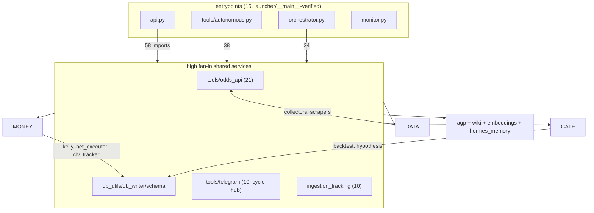

# ARCHITECTURE_MAP — Wave 1 Cartography

**Branch:** `cartography/architecture-map` (off `audit/2026-08-roadmap` @ `fdf4d1d`)
**Date:** 2026-08-22 · **Scope:** `tools/`, `agp/`, root `*.py` (143 modules), cross-referenced against `tests/` (93 files), `scripts/`, and launchers.
**Method:** static AST analysis (import resolution incl. function-level imports, reference counting over names/attributes/strings/`__all__`), vulture 2.16 @ min-confidence 60, and a **real coverage run** (`pytest --cov`, 1,006 passed / 12 failed / 8 skipped, 2 files uncollectable in this env).

Evidence discipline per AUDIT_MANDATE §1: every claim below is tagged **VERIFIED** (measured against this tree) or **INFERRED** (reasoned). Analysis scripts live in `/tmp/opencode/callisto/` (throwaway, not committed); all numbers regenerate from this tree.

---

## 1. Import graph — VERIFIED

143 nodes, 324 internal import edges — of which only **153 are import-time (module-level)**. **Zero import-time cycles.** All 27 cycles in the full graph are created by *function-level (deferred) imports* — a deliberate-looking pattern that avoids import deadlocks but hides coupling.

### 1.1 God-modules (fan-in = how many modules import it; fan-out = internal imports it makes)

| rank | highest fan-in | in | | highest fan-out | out |
|---|---|---|---|---|---|
| 1 | `tools.odds_api` | 21 | | `api` | 58 |
| 2 | `tools.math_utils` | 14 | | `tools.autonomous` | 38 |
| 3 | `tools.db_utils` | 13 | | `orchestrator` | 24 |
| 4 | `tools.db_writer` | 12 | | `tools.line_monitor` | 22 |
| 5 | `tools.telegram` | 10 | | `tools.backtest` | 12 |
| 6 | `tools` (pkg init) | 10 | | `tools.edge_scanner` | 10 |
| 7 | `tools.ingestion_tracking` | 10 | | `tools.hypothesis` | 10 |
| 8 | `tools.embeddings` | 7 | | `tools.self_repair` | 10 |
| 9 | `inference` | 7 | | `tools.bet_executor` | 8 |
| 10 | `tools.book_keys` | 7 | | `tools.clv_tracker` | 8 |

**Reading:** `api` (fan-out 58) and `tools.autonomous` (38) import half the system — they are the hubs. `tools.odds_api` (fan-in 21) is the shared odds vocabulary. `tools.telegram` is fan-in 10 **and** participates in 18 of 27 cycles: every subsystem imports the notifier and the notifier reaches back — the notification layer has become a de-facto service locator.

### 1.2 Cycles — VERIFIED (all lazy)

- Import-time cycles: **0**.
- All-scope cycles: 27. **25 of 27 route through the `api` ↔ `tools.telegram` pair** (telegram is imported lazily inside functions across api/autonomous/event_bus/line_monitor/order_*/bet_executor/clv_tracker/data_collector/self_repair/health).
- The 3 hub-free mutual imports: `tools.order_manager ↔ tools.order_reconciler`, `tools.backtest ↔ tools.schema`, `tools.hypothesis ↔ tools.hypothesis_generator`.

**Finding (INFERRED):** the lazy-import web around `telegram` is the single largest structural debt. It makes "who actually depends on the notifier" unmeasurable by import-time analysis and means any refactor of `telegram.py` (fan-in 10, fan-out to api) has hidden blast radius.

### 1.3 Orphans (fan-in = 0, not an entrypoint, no test/script consumer) — VERIFIED

12 real orphans after excluding `tools.migrations.*` (001–012 are discovered and `importlib.import_module`-loaded by `tools/migrations/runner.py` — **not dead**, convention-loaded):

| orphan | what it is | note |
|---|---|---|
| `tools.ml_backtest` | ML signal trading sim | 0% line coverage; no test, no script, no launcher |
| `tools.news_loop` | background news coroutines | 0% coverage; superseded? (news_ingestion has its own loop) — INFERRED retire candidate |
| `wal_fix` | 9-line one-off WAL patch | one-off, attic candidate |
| `analysis` | root analysis script | debug artifact |
| `callisto_query`, `callisto_query2`, `query_bt`, `query_hyps`, `query_hyps_debug`, `query_pipeline`, `run_query`, `check_nba_events` | root one-off debug scripts | 8 files, ~580 lines of session debris |

**Caveat (VERIFIED limitation):** `tools/self_repair.py:233,470` calls `__import__(mod_path)` with config-driven paths, so a static pass cannot prove *anything* unreachable against a hostile config. The orphan table holds for the shipped configuration.

### 1.4 Shape (mermaid, tier-level; full graph regenerable from scripts)

### 1.5 Entrypoints (15) — VERIFIED via `__main__` blocks or shell launchers

`api`, `monitor`, `upstream_review` (root); `tools.autonomous`, `tools.callisto_mcp_server`, `tools.local_cc_bridge`, `tools.tci_scraper` (`__main__`); `tools.claude_code`, `tools.embeddings`, `tools.health`, `tools.line_monitor`, `tools.odds_api`, `tools.searxng`, `tools.environment`, `tools` (matched in `scripts/` shells / docker-compose / bridge scripts — stem-match evidence, medium confidence for the last four).

---

## 2. Dead code — VERIFIED (method + full lists)

Two independent passes, then reconciled:

1. **vulture 2.16, min-confidence 60** over `tools/ agp/ *.py`: **439 findings** (202 unused functions, 143 unused variables, 41 unused attributes, 29 unused methods, 22 unused imports, 1 class, 1 property).
2. **AST reference pass** over 2,096 non-test function/method defs, counting every `Name`, `Attribute`, import alias, string literal (≥3 chars, catches `getattr`/dict-dispatch), and `__all__` export across the whole repo (tests and scripts included as reference sources).

AST pass reconciliation — confidence labels:

| category | count | confidence | meaning |
|---|---|---|---|
| **DEAD** — zero references anywhere in repo | **64** | high | no name/attr/string/import alias mentions at all |
| dead-excluded (dynamic risk) | 100 | excluded | decorated (route/fixture/handler) or inherited-class method or in `__all__` |
| **TEST-ONLY** — referenced only from `tests/` | 11 | high | production code never calls them |
| **OWN-TEST-ONLY** — referenced only by the test file named after their own module | 8 | high | "kept alive only by its own test" |
| module-internal-only | ~950 | n/a | private helpers used within their own file — alive, not listed |
| live | 904 | n/a | referenced from ≥1 production file |

**Method caveats (falsifiers in §6):** docstrings and string literals are treated as references (over-inclusive by design); comments are not parsed and do not keep code alive; decorated functions are never claimed dead because FastAPI/pytest/click discover them by decoration; `self_repair`'s config-driven `__import__` can resurrect any module at runtime. "Imported but never called" is reported separately — the AST pass counts import aliases as references (conservative), so such functions appear live here even if no call site exists.

### 2.1 The 64 high-confidence dead functions (VERIFIED zero references)

Grouped by subsystem — **money-path items bolded** (they are Tier-0 adjacent and dead):

**Execution / orders / money**
- `tools/bet_executor.py:219` `BetExecutor.get_daily_stakes` — a stake-limit query nobody calls
- `tools/order_reconciler.py:164` `_american_payout`
- `tools/order_manager.py:730` `reset_manager`
- `tools/local_compute.py:123` `local_kelly` — a *local* Kelly implementation, dead
- `tools/math_utils.py:41` `decimal_to_implied`
- `tools/correlation.py:398,405,552,994` `_prob_to_decimal`, `_adjust_joint_probability`, `detect_mispriced_correlation`, `estimate_sgp_vig`

**Imported-unused (not counted in the 64; the AST pass counts import aliases as references):**
- `tools/ev.py:53` `ev_free_bet` — imported by `orchestrator.py:87`, zero call sites anywhere in the repo.

**Data plane**
- `tools/dk_scraper.py:1098,1142,1242` all three golf functions; `tools/fanduel_scraper.py:305` golf outrights
- `tools/odds_api_io.py:609,622,960` `get_outrights`, `snapshot_all_sports`, `get_odds_multi`
- `tools/odds_ws.py:212` + `tools/line_monitor.py:591` both `get_ws_status` — the WebSocket status surface is dead on both ends (INFERRED: odds_ws streaming never wired)
- `tools/line_monitor.py:1039` `_enrich_with_mgm`; `tools/betmgm_scraper.py:453` `scrape_betmgm_fixture`
- `tools/action_network_scraper.py:633` `get_public_betting`; `tools/prop_scraper_free.py:147,1293` `_classify_dk_nash_prop`, `close_clients`
- `tools/data_collector.py:845` `DataCollector.collect_date_range`
- `tools/historical_odds.py:131` `get_prop_dates`; `tools/tci_scraper.py:609` `get_tci_matchup`

**Gate / models**
- `tools/hypothesis.py:2716` `HypothesisManager._get_paper_trades_all`
- `tools/temporal_analysis.py:97,178,281,1075` four of its public loaders
- `tools/line_analysis.py:1339` `full_line_analysis`
- `tools/pace_model.py:1118,1235,1403` + `tools/simulation.py:451,663,985,1362` — the two Monte Carlo engines are ~40% unreferenced internally (pace/sim integration is INFERRED half-built)
- `tools/sgp_scanner.py:184,190` `_is_player_leg`, `_is_team_leg`
- `tools/schema.py:1975` `get_book_tier` — **the book-tier lookup is dead**; ROADMAP says VERIFIED tier is unreachable because tiers are never assigned; here is the matching dead accessor (INFERRED: same root cause)

**Epistemics / infra**
- `tools/knowledge_wiki.py:53` `get_write_stats`
- `tools/hermes_memory.py:301,389` `record_learnings_batch`, `get_unread_messages`
- `tools/embeddings.py:485,517,576,742` four VectorStore ops incl. `embed_prop_outcome`
- `tools/health.py:302,870` `ErrorTracker.is_rate_exceeded`, `SystemHealth.is_subsystem_healthy`
- `tools/telegram.py:435` `_cmd_query_safe`; `tools/game_scheduler.py:227` `get_upcoming`
- `tools/injury_model.py:1557` `lookup_position_impact`; `tools/dead_numbers.py:476` `get_margin_distribution`
- `tools/db_utils.py:197` `bulk_write`; `tools/odds_api.py:39` `_redact_url` (a redaction helper, dead)
- `inference.py:28,34,760` `_get_hermes_tools`, `_get_hermes_validator`, `OllamaInference.aping`
- `tools/local_cc_bridge.py:215` `_kill_process_tree`
- `tools/news_ingestion.py:520` `_dedup_key`
- `tools/market_psychology.py:687` `optimal_hedge_time`

### 2.2 vulture-only signals worth eyes (60% confidence, not AST-corroborated)

439 findings total; the full list is mechanical. Notable clusters: `tools/thesis_seeds.py` seed-coverage helpers, `tools/work_queue.py:321` unused `focus_context`, 22 unused imports across `tools/` (cheap hygiene), 1 unused class. Vulture's unused-*variable* hits (143) include many ORM-ish locals — treat as noise until triaged.
