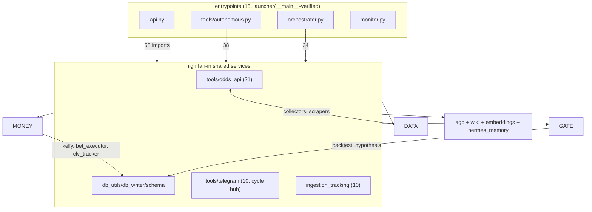

# ARCHITECTURE_MAP — Wave 1 Cartography

**Branch:** `cartography/architecture-map` (off `audit/2026-08-roadmap` @ `fdf4d1d`)
**Date:** 2026-08-22 · **Scope:** `tools/`, `agp/`, root `*.py` (143 modules), cross-referenced against `tests/` (93 files), `scripts/`, and launchers.
**Method:** static AST analysis (import resolution incl. function-level imports, reference counting over names/attributes/strings/`__all__`), vulture 2.16 @ min-confidence 60, and a **real coverage run** (`pytest --cov`, 1,006 passed / 12 failed / 8 skipped, 2 files uncollectable in this env).

Evidence discipline per AUDIT_MANDATE §1: every claim below is tagged **VERIFIED** (measured against this tree) or **INFERRED** (reasoned). Analysis scripts live in `/tmp/opencode/callisto/` (throwaway, not committed); all numbers regenerate from this tree.

---

## 1. Import graph — VERIFIED

143 nodes, 324 internal import edges — of which only **153 are import-time (module-level)**. **Zero import-time cycles.** All 27 cycles in the full graph are created by *function-level (deferred) imports* — a deliberate-looking pattern that avoids import deadlocks but hides coupling.

### 1.1 God-modules (fan-in = how many modules import it; fan-out = internal imports it makes)

| rank | highest fan-in | in | | highest fan-out | out |
|---|---|---|---|---|---|
| 1 | `tools.odds_api` | 21 | | `api` | 58 |
| 2 | `tools.math_utils` | 14 | | `tools.autonomous` | 38 |
| 3 | `tools.db_utils` | 13 | | `orchestrator` | 24 |
| 4 | `tools.db_writer` | 12 | | `tools.line_monitor` | 22 |
| 5 | `tools.telegram` | 10 | | `tools.backtest` | 12 |
| 6 | `tools` (pkg init) | 10 | | `tools.edge_scanner` | 10 |
| 7 | `tools.ingestion_tracking` | 10 | | `tools.hypothesis` | 10 |
| 8 | `tools.embeddings` | 7 | | `tools.self_repair` | 10 |
| 9 | `inference` | 7 | | `tools.bet_executor` | 8 |
| 10 | `tools.book_keys` | 7 | | `tools.clv_tracker` | 8 |

**Reading:** `api` (fan-out 58) and `tools.autonomous` (38) import half the system — they are the hubs. `tools.odds_api` (fan-in 21) is the shared odds vocabulary. `tools.telegram` is fan-in 10 **and** participates in 18 of 27 cycles: every subsystem imports the notifier and the notifier reaches back — the notification layer has become a de-facto service locator.

### 1.2 Cycles — VERIFIED (all lazy)

- Import-time cycles: **0**.
- All-scope cycles: 27. **25 of 27 route through the `api` ↔ `tools.telegram` pair** (telegram is imported lazily inside functions across api/autonomous/event_bus/line_monitor/order_*/bet_executor/clv_tracker/data_collector/self_repair/health).
- The 3 hub-free mutual imports: `tools.order_manager ↔ tools.order_reconciler`, `tools.backtest ↔ tools.schema`, `tools.hypothesis ↔ tools.hypothesis_generator`.

**Finding (INFERRED):** the lazy-import web around `telegram` is the single largest structural debt. It makes "who actually depends on the notifier" unmeasurable by import-time analysis and means any refactor of `telegram.py` (fan-in 10, fan-out to api) has hidden blast radius.

### 1.3 Orphans (fan-in = 0, not an entrypoint, no test/script consumer) — VERIFIED

12 real orphans after excluding `tools.migrations.*` (001–012 are discovered and `importlib.import_module`-loaded by `tools/migrations/runner.py` — **not dead**, convention-loaded):

| orphan | what it is | note |
|---|---|---|
| `tools.ml_backtest` | ML signal trading sim | 0% line coverage; no test, no script, no launcher |
| `tools.news_loop` | background news coroutines | 0% coverage; superseded? (news_ingestion has its own loop) — INFERRED retire candidate |
| `wal_fix` | 9-line one-off WAL patch | one-off, attic candidate |
| `analysis` | root analysis script | debug artifact |
| `callisto_query`, `callisto_query2`, `query_bt`, `query_hyps`, `query_hyps_debug`, `query_pipeline`, `run_query`, `check_nba_events` | root one-off debug scripts | 8 files, ~580 lines of session debris |

**Caveat (VERIFIED limitation):** `tools/self_repair.py:233,470` calls `__import__(mod_path)` with config-driven paths, so a static pass cannot prove *anything* unreachable against a hostile config. The orphan table holds for the shipped configuration.

### 1.4 Shape (mermaid, tier-level; full graph regenerable from scripts)

### 1.5 Entrypoints (15) — VERIFIED via `__main__` blocks or shell launchers

`api`, `monitor`, `upstream_review` (root); `tools.autonomous`, `tools.callisto_mcp_server`, `tools.local_cc_bridge`, `tools.tci_scraper` (`__main__`); `tools.claude_code`, `tools.embeddings`, `tools.health`, `tools.line_monitor`, `tools.odds_api`, `tools.searxng`, `tools.environment`, `tools` (matched in `scripts/` shells / docker-compose / bridge scripts — stem-match evidence, medium confidence for the last four).
